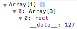
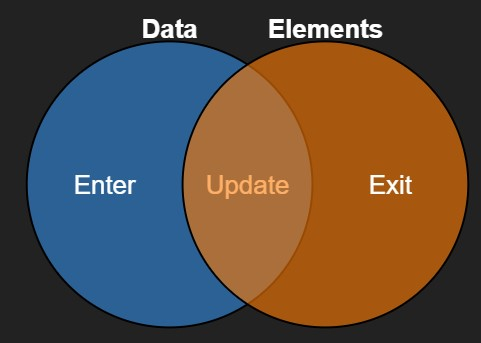

# D3.js Tutorial - First part

A tutorial by [Kanit "Ham" Wongsuphasawat](http://kanitw.yellowpigz.com/) (@kanitw) and [Dominik Moritz](http://homes.cs.washington.edu/~domoritz/) (@domoritz)  
[Interactive Data Lab, University of Washington](http://idl.cs.washington.edu/)  
(Based on [Vadim Ogievetsky](http://vadim.ogievetsky.com/IntroD3) and [Scott Murray](http://alignedleft.com/tutorials/d3/)'s work)

## Outline
- Examples
- Selections & Data
- Transitions
- Nested Selections

Part 2: Interactions, scales, axes, data, layouts

## Data-Driven Documents (D3)
### What D3 is not
- Not a **chart library** (but it can make charts)
- Not a **compatibility layer**
- Not **(only) about SVG or HTML or Canvas**

### D3 is Data ↦ Elements
- Visualizing Data with Web Standards (HTML/SVG)
- Data ↦ Elements – constructing the DOM from Data
- In visualization, each data point has a corresponding element (graphical marks). D3 helps you maintain this mapping!

### Show Reels
[See](http://vis.stanford.edu/jheer/talks/VisWeek2012/#1)

## Selections
D3 uses CSS Selectors  
Single selector:
```
#foo        // <any id="foo"> </any>
foo         // <foo> </foo>
.foo        // <any class="foo"> </any>
[foo=bar]   // <any foo="bar"> </any>
foo bar     // <foo><bar> </bar></foo>
```
Multiple selectors:
```
foo.bar     // <foo class="bar"> </foo>
foo#bar     // <foo id="bar"> </foo>
```

### .select()
```html
<body>
  <div><button onclick="run();" id="run">Run A</button></div>
  <svg>
    <rect x="150" y="100" width="60" height="200"></rect>
  </svg>
</body>

<style>
svg{ width:500px;height:300px; }
svg rect{ fill:#ccc;stroke:gray;stroke-width:2px; }
</style>

<script src="https://d3js.org/d3.v7.min.js"></script>
<script>
var svg = d3.select("svg")
var run = function() {
  var myRect = svg.select("rect")
  myRect.attr("width", 100)
  myRect.attr("height", 100)
  myRect.style("fill", "steelblue")
}
</script>
```

### .select() + .attr(), .style()
Select and modify element properties with different ways (non-chain, chain):
```html
<!-- Modified from http://vadim.ogievetsky.com/IntroD3-->
<div><button onclick="runA();">Run A </button><button onclick="runB();">Run B </button><button onclick="runC();">Run C </button></div>
<svg>
  <rect x="200" y="100" width="40" height="50"></rect>
  <!--<rect x="100" y="20" width="30" height="50"></rect>
  <rect x="10" y="200" width="25" height="90"></rect>-->
</svg>

<style>svg{width:500px;height:300px;}svg rect{fill:#ccc;stroke:gray;stroke-width:2px;}</style>

<script>
var svg = d3.select("svg");
function runA() { //non-chain
  var rect = svg.select("rect");
  rect.attr("width", 100);
  rect.attr("height", 100);
  rect.style("fill", "steelblue");
}
function runB() { //or chain
  svg.select("rect").attr("width", 90).attr("height", 90).style("fill", "steelblue");
}
function runC() { //or chain with param object
  d3.select("svg").select("rect").attr({ "width": 60, "height": 60 }).style({ "fill": "steelblue" });
}
</script>
```
>[Note](https://stackoverflow.com/questions/38684597/cannot-use-attr-with-an-object-in-d3-v4): from D3 v4 onwards you **cannot use objects to set `attr()` or `style()`** anymore. To do so, you have to reference the mini library D3-selection-multi: `<script src="https://d3js.org/d3-selection-multi.v0.4.min.js">`

but `.select()` only selects one item!

### .selectAll()
```js
var svg = d3.select("svg");
function runA() { //non-chain
    var rect = svg.selectAll("rect");
    rect.attr("width", 90);
    rect.attr("height", 90);
    rect.style("fill", "steelblue");
}
function runB() { //or chain
    svg.selectAll("rect").attr("width", 50).attr("height", 50).style("fill", "steelblue");
}
```

## .data()
Data ↦ Attributes  
Tell D3 that you want the selected elements to correspond to data!  
See in console that the selected rect selection object is an array of array that embed data in `__data__` property!
```html
<!-- Modified from http://vadim.ogievetsky.com/IntroD3-->
<div><button onclick="run();">Run </button></div>
<svg>
  <rect x="200" y="100" width="40" height="50"></rect>
  <rect x="100" y="20" width="30" height="50"></rect>
  <rect x="10" y="200" width="25" height="90"></rect>
</svg>
<style>svg{width:500px;height:300px;}svg rect{fill:#ccc;stroke:gray;stroke-width:2px;}</style>
<script>
function run(){
  var svg = d3.select("svg");
  var data =[127, 61, 256];
  var rects = svg.selectAll("rect")
    .data(data)
    .attr("x", 0)
    .attr("y", function(d,i) { return i*30+30 })
    .attr("width", function(d,i) { return d; })
    .attr("height", 20)
    .style("fill", "steelblue")
  console.log(rects);
}
</script>
```
### Selection Object
- An array of arrays
- if `.data()` is called, `__data__` of each element will contain the data mapped to that element.  


Data can be objects too!
```html
<!-- Modified from http://vadim.ogievetsky.com/IntroD3-->
<div><button onclick="run();">Run </button></div>
<svg>
  <circle cx="30" cy="40" r="5"></circle>
  <circle cx="50" cy="60" r="5"></circle>
  <circle cx="80" cy="30" r="5"></circle>
  <circle cx="10" cy="70" r="5"></circle>
</svg>

<script>
function run(){
  var svg = d3.select("svg");
  var data = [
      {x: 100, y: 194},
      {x:  80, y: 184},
      {x: 130, y: 74},
      {x:  90, y: 87}
    ];
  var circles = svg.selectAll("circle")
    .data(data)
    .attr("cx", function(d){return d.x;})
    .attr("cy", function(d){return d.y;})
    .style("fill", function(d){
      return d.x >= 100 ? "red" : "steelblue";
    });
  console.log(circles);
}
</script>
```

What if number of data doesn't match number of items selected?
```html
<script>
var svg = d3.select("svg");
function runMore(){
  svg.selectAll("rect")
    .data([127, 61, 256, 23])
    .attr("x", 0)
    .attr("y", function(d,i) { return i*30+30 })
    .attr("width", function(d,i) { return d; })
    .attr("height", 20)
    .style("fill", "steelblue")
}
function runLess(){
  svg.selectAll("rect")
    .data([43, 66])
    .attr("x", 0)
    .attr("y", function(d,i) { return i*30+30 })
    .attr("width", function(d,i) { return d; })
    .attr("height", 20)
    .style("fill", "steelblue")
}
</script>
```
Thinking with Join

Calling `.data()` creates three arrays:
- `enter` (Data without corresponding DOM elements)
- `update` (DOM elements mapped to data)
- `exit` (DOM elements now missing data)

`.data()` returns the `update`.

#### .enter()
```html
<button onclick="run();">Run </button>
<svg width=400 height=300>
  <rect x="200" y="100" width="40" height="50"></rect>
  <rect x="100" y="20" width="30" height="50"></rect>
  <rect x="10" y="200" width="25" height="90"></rect>
</svg>
<script>
function run(){
  var svg = d3.select("svg");
  // 4 data items
  var selection = svg.selectAll("rect")
    .data([127, 61, 256, 71]);

  selection
    .attr("x", 0)
    .attr("y", function(d,i) { return i*30+30 })
    .attr("width", function(d,i) { return d; })
    .attr("height", 20)
    .style("fill", "steelblue");

  selection.enter().append("rect")
    .attr("x", 0)
    .attr("y", function(d,i) { return i*30+30 })
    .attr("width", function(d,i) { return d; })
    .attr("height", 20)
    .style("fill", "steelblue");
}
</script>
```

#### .enter() from scratch
Shorter: append, then update all together!  
This is a common way that people build visualization in D3!
```html
<button onclick="run();">Run </button>
<svg width=400 height=300></svg>
<script>
function run(){
  var svg = d3.select("svg");
  // 4 data items
  var selection = svg.selectAll("rect")
    .data([127, 61, 256, 71]);
  selection.enter().append("rect");
  selection
    .attr("x", 0)
    .attr("y", function(d,i) { return i*30+30 })
    .attr("width", function(d,i) { return d; })
    .attr("height", 20)
    .style("fill", "steelblue");
}
</script>
```
>Attention! Code above worked correct in d3js version `3.x.x`. With version 7 worked only if btn clicked twice. #TODO  
This modified code works with d3.v7:
```js
function run(){
  var svg = d3.select("svg");
  // 4 data items
  var selection = svg.selectAll("rect")
    .data([127, 61, 256, 71]);
  selection.enter().append("rect")//; //modification
  //selection                         //modification
    .attr("x", 0)
    .attr("y", function(d,i) { return i*30+30 })
    .attr("width", function(d,i) { return d; })
    .attr("height", 20)
    .style("fill", "steelblue");
}
```

#### .exit()
```html
<div><button onclick="run();">Run </button></div>
<svg width=500 height=300>
  <rect x="200" y="100" width="40" height="50"></rect>
  <rect x="100" y="20" width="30" height="50"></rect>
  <rect x="10" y="200" width="25" height="90"></rect>
</svg>
<script>
function run(){
  var svg = d3.select("svg");
  // 4 data items
  var selection = svg.selectAll("rect")
    .data([127, 61]);
  selection.attr("x", 0)
    .attr("y", function(d,i) { return i*30+30 })
    .attr("width", function(d,i) { return d; })
    .attr("height", 20)
    .style("fill", "steelblue");
  selection.exit().remove(); // remove elements if it no data
}
</script>
```

## Transitions
### .transition()
```js
function run(){
  var svg = d3.select("svg");
  svg.selectAll("rect")
    .data([127, 61, 256])
    .transition()
    .duration(1500)  // 1.5 second
      .attr("x", 0)
      .attr("y", function(d,i) { return i*90+50; })
      .attr("width", function(d,i) { return d; })
      .attr("height", 20)
      .style("fill", "steelblue");

}
```
>Note: Transitions in D3 use cubic-in-out as default easing functions. But [there are others](https://github.com/mbostock/d3/wiki/Transitions#wiki-d3_ease).

### Nested .transition() & .delay()
```js
function run(){
  var svg = d3.select("svg");
  svg.selectAll("rect")
    .data([127, 61, 256])
    .transition()
    .duration(1500) // 1.5 seconds
      .attr("x", 0)
      .attr("y", function(d,i) { return i*90+50; })
      .attr("width", function(d,i) { return d; })
      .attr("height", 20)
      .style("fill", "steelblue")
    .transition()
    .duration(1500) // 1.5 seconds
      .attr("x", 0)
      .attr("y", function(d,i) { return i*30+30; })
      .attr("width", function(d,i) { return i*30+d; })
      .attr("height", 20)
      .style("fill", "green");
}
```

### Mapping Data to Elements
The default is index mapping.
```js
var data = [10, 20, 30, 40, 50, 60, 70, 80, 90, 100, 110, 120];
var svg = d3.select("svg");
svg.selectAll("rect")
.data(data)
.enter().append("rect")
    .attr("x", function(d,i) { return i*20+30; })
    .attr("y", function(d,i){return 200-d;})
    .attr("width", 10)
    .attr("height", function(d,i) { return d; })
    .style("fill", "steelblue");
function run(){
    var first = data.shift();
    data.push(first);
    svg.selectAll("rect")
      .data(data)
      .transition()
      .duration(1000) // 3 seconds
        .attr("x", function(d,i) { return i*20+30; })
        .attr("y", function(d,i){return 200-d;})
        .attr("width", 10)
        .attr("height", function(d,i) { return d; });
}
```

### Join key – .data(...,key)
A key should be a unique string.
```js
var I = function(d){return d;};
var data = [10, 20, 30, 40, 50, 60, 70, 80, 90, 100, 110, 120];;

var svg = d3.select("svg");
svg.selectAll("rect")
.data(data, I)
.enter().append("rect")
  .attr("x", function(d,i) { return i*20+30 })
  .attr("y", function(d,i){return 200-d;})
  .attr("width", 10)
  .attr("height", function(d,i) { return d; })
  .style("fill", "steelblue");

function run(){
  var first = data.shift();
  data.push(first);
  svg.selectAll("rect")
    .data(data, I)
    .transition()
    .duration(1000) // 3 seconds
      .attr("x", function(d,i) { return i*20+30 })
      .attr("y", function(d,i){return 200-d;})
      .attr("width", 10)
      .attr("height", function(d,i) { return d; })
}
```
http://bost.ocks.org/mike/selection/#key

Notice how you can save lines of code with `selection.call()`:
```js
var data = [10, 20, 30, 40, 50, 60, 70, 80, 90, 100, 110, 120];;
var I = function(d,i)   {return i*20+30 };
function updateRect(rect){
  return rect.attr("x", I)
    .attr("y", function(d,i){return 200-d;})
    .attr("width", 10)
    .attr("height", function(d,i) { return d; })
    .style("fill", "steelblue");
}  
var svg = d3.select("svg");
svg.selectAll("rect")
.data(data, I)
.enter().append("rect")
  .call(updateRect);
function run(){
  var first = data.shift();
  data.push(first);
  svg.selectAll("rect")
    .data(data, function(d){ return d; })
    .transition()
    .duration(1000) // 3 seconds
      .call(updateRect)
}
```

New data?
```js
var i=0;
var data = [10, 20, 30, 40, 50, 60, 70, 80, 90, 100, 110, 120].map(function(x){return {id:i++, x:x};});

var formatRect = function(sel){
  sel.attr("x", function(d,i) { return i*20+30; })
    .attr("y", function(d,i){return 200-d.x;})
    .attr("width", 10)
    .attr("height", function(d,i) { return d.x; })
    .style("fill", "steelblue");
  return sel; // should return object for chain calling.
};

var getId = function(d){return d.id;};

var svg = d3.select("svg");
svg.selectAll("rect")
.data(data, getId)
.enter().append("rect")
  .call(formatRect);

function run(){
  data.shift(); //remove first
  data.push({id:i, x: (i%15+1)*10 });
  i++;
  console.log(data);
  var rects = svg.selectAll("rect")
    .data(data, getId);
  rects.enter().append("rect");
  rects.transition()
    .duration(1000) // 3 seconds
    .call(formatRect);
  rects.exit()
    .transition().duration(500)
    .style("opacity","0")
    .remove();

}
```
See even better [bar transition](http://mbostock.github.io/d3/tutorial/bar-2.html)

### See also
-   General Update Pattern [I](http://bl.ocks.org/mbostock/3808218), [II](http://bl.ocks.org/mbostock/3808221), [III](http://bl.ocks.org/3808234)
-   [Three Little Circles](http://mbostock.github.io/d3/tutorial/circle.html)
-   [Working with Transitions](http://bost.ocks.org/mike/transition/)

## Nested Selections
```html
<svg width=200 height=300></svg>
<script>
var myData = [
  [15, 20],
  [40, 10],
  [30, 17]
];
var svg = d3.select("svg");

// First selection (within svg)
var selA = svg.selectAll("g").data(myData);
selA.enter().append("g")//; //modification comment for work with d3 v7
//selA                      //modification comment for work with d3 v7
  .attr("transform", function(d,i) {
    return "translate(70," + (i*100+50) + ")";
  });
selA.exit().remove();

// Second selection (within first selection)
var selB = selA.selectAll("circle")
  .data(function(d) { return d; });
selB.enter().append("circle")//; //modification comment for work with d3 v7 (NOT WORKED)
//selB                           //modification comment for work with d3 v7 (NOT WORKED)
  .attr("cx", function(d,i) { return i*80 })
  .attr("r", function(d,i) { return d });
selB.exit().remove();
</script>
```
>Attention! Here in second part of code, modification comment not enough for fix for d3 v7 #TODO: need fix

### See also
- [How Selection Works](http://bost.ocks.org/mike/selection/)  
- [Two Tables](https://www.prcweb.co.uk/lab/selection/)

### More examples
-   [bl.ocks.org/mbostock/3887051](http://bl.ocks.org/mbostock/3887051)
-   [bost.ocks.org/mike/miserables/](http://bost.ocks.org/mike/miserables/)